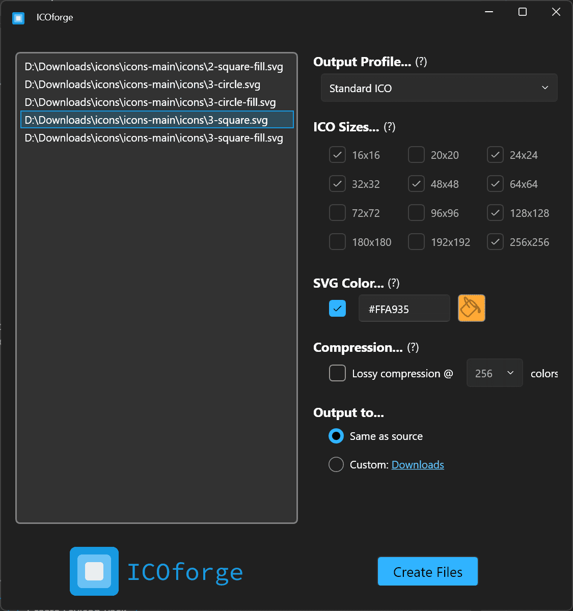

#  ICOforge

ICOforge is a Windows utility for converting various image formats into multi-resolution `.ico` files. It supports SVG colorization and can produce Favicon packs for use with websites.

## ✨ Features

- **Bulk Image Conversion:** Convert multiple image files (PNG, JPG, BMP, GIF) to the `.ico` format in a single batch.
- Choose Standard (16, 24, 32, 48, 64, 128, 256 pixels), Application (16, 20, 24, 32, 48, 64, 72, 96, 128, 256), Favicon (16, 32, 48, 64), or Custom (reveals ICO sizes to choose)
- **Custom ICO Profiles:** Choose exactly which image sizes (16, 20, 32, 48, 64, 72, 96, 128, 180, 192, 256) and color depths (4, 8, 16, 32, 64, 128, 256) to include in the final `.ico` file.
- **SVG Colorization:** When converting SVG icons, you can apply a custom color, allowing you to quickly generate themed icon sets from a single source file or icon library.
- **Theme Aware UI:** The application's interface automatically syncs with the Windows light or dark mode setting for a seamless, native feel.
- **Modern & Simple Interface:** A clean, fluent user interface makes the conversion process intuitive.

---

## 🛠️ Tech Stack

This application is built using a modern Windows stack:

- **Language:** **C#** - The core application logic is written in C#, the primary language for .NET development.
- **Framework:** **.NET & WPF** - The app is built on the **.NET** platform with **Windows Presentation Foundation (WPF)** for the user interface, ensuring a responsive and native experience.
- **UI Library:** **WPF-UI** - To achieve a modern look and feel, and to handle automatic light/dark theme switching, the project uses the **WPF-UI** library (<https://github.com/lepoco/wpfui>). This provides WinUI / Fluent controls and styles.
- **Image Processing:** **SixLabors.ImageSharp** - A powerful, cross-platform 2D graphics library used for all image manipulation.

---

## Reference Docs

- <https://learn.microsoft.com/en-us/windows/win32/uxguide/vis-icons>
- <https://en.wikipedia.org/wiki/ICO_(file_format)>
- <https://docs.fileformat.com/image/ico/>
